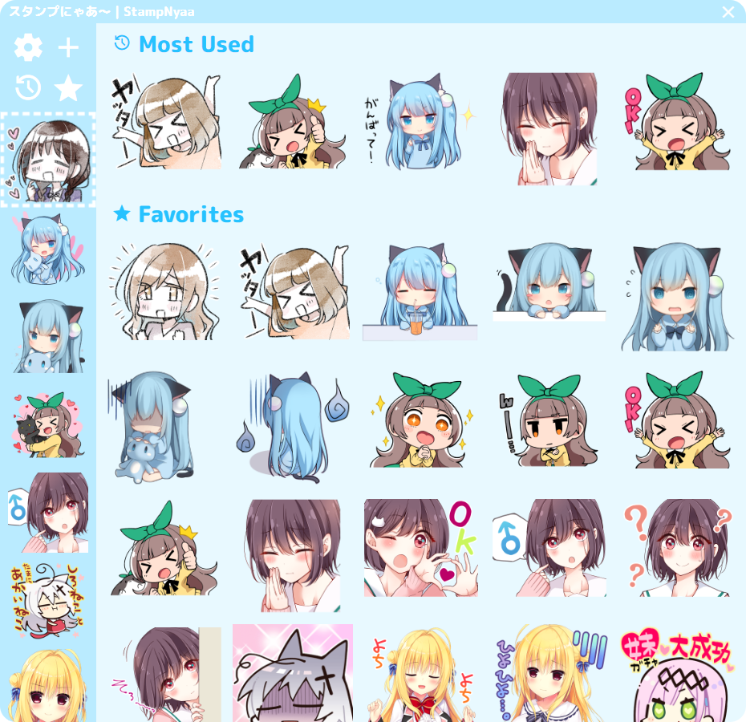

<p align="center">
  
</p>
<h1 align="center">StampNyaa | スタンプにゃあ～</h1>
<p align="center">
  
</p>
<p align="center">
  <a href="https://github.com/MarvNC/StampNyaa/releases/latest">
    
  </a>
  <a href="https://github.com/MarvNC/StampNyaa/releases/latest">
    
  </a>
  <a href="https://github.com/MarvNC/StampNyaa/releases/latest">
    
  </a>
</p>

## 🎉 Download LINE Stickers and Use Them Anywhere

StampNyaa is a simple cross-platform desktop app for downloading and using LINE stickers in Discord, Whatsapp, Telegram, and anywhere else you can paste images.

## 🚀 Download

[](https://github.com/MarvNC/StampNyaa/releases/latest)

[Click here to go to the releases page](https://github.com/MarvNC/StampNyaa/releases/latest) and download the appropriate installer for your operating system in "Assets" (MacOS users should download `darwin`).

## 📚 About

### 🔧 Usage

- **Use the hotkey** `Ctrl/Command+Shift+A` by default to open the app at any time, or click the icon in your system tray. You can change this hotkey from the settings menu at any time.
- **Find your favorite sticker packs** on the [LINE Sticker Shop](https://store.line.me/stickershop/).
- **Download LINE sticker packs** for use with StampNyaa by pressing the + icon in the sidebar and pasting in the sticker pack's URL. Or you can **[add your own stickers](#-add-your-own-stickers)**.
- **Favorite stickers for easy access** by right-clicking on them to add them to your favorites list.
- **Send stickers** by clicking on them in the app, and they will be automatically pasted to the app you're currently using.

Keep in mind that sticker packs from LINE are created by skilled artists and are sold for use in the LINE app; this application simply aims to let you to use them in other apps. Make sure to **support the creators** by purchasing the sticker packs you use! LINE supports PayPal and various other payment methods, so purchasing shouldn't be an issue outside of region locks.

> [!WARNING]\
> Some stickers are region locked and cannot be downloaded in certain countries. If you are unable to download a sticker pack, try using a VPN to change your location. You can check if the sticker pack works in a country by opening the store page in incognito with a VPN set to that country.

### 🎞️ Showcase

|             **Send Stickers on Discord**             |            **Choose a Theme**             |
| :--------------------------------------------------: | :---------------------------------------: |
|   |    |
|          **Choose Your Favorite Stickers**           |     **Manage and Sort Your Stickers**     |
|  |  |

Here are the creators whose stickers are shown in the above images:

- [雪子](https://store.line.me/stickershop/author/1719182/ja) - Futaribeya mangaka
- [甘城なつき](https://store.line.me/stickershop/author/95033/ja) - Nyaa stamps
- [万丈梓](https://store.line.me/stickershop/author/3253391/ja) - Mangaka of 恋する(おとめ)の作り方
- [ななひら](https://store.line.me/stickershop/author/283446/ja) - Nanahira
- [こもわた遙華](https://store.line.me/stickershop/author/674845/ja) - Famous SD chibi artist
- [まどそふと](https://store.line.me/stickershop/author/106050/ja) - Madosoft
- [Navel](https://store.line.me/stickershop/author/79657/ja) - Navel, featuring 小倉朝日
- [clear_blue](https://store.line.me/stickershop/author/552857/ja) - Publisher of stickers for Yuzusoft

## 🎨 Add Your Own Stickers

StampNyaa supports adding your own sticker packs to the app.

- Simply add a folder to the `stickers` directory in the app's sticker folder, which is located in your `{user}/Pictures` folder by default.
- The folder name will be used as the sticker pack name by default, and the images inside will be used as the stickers.
- You will also need to add a sticker named `main.png` to be used as the icon representing the sticker pack in the sidebar.
- Note that only `.png` images are currently supported.
- After adding new stickers to your `stickers` directory, press `ctrl + r` in the app to refresh and your newly added stickers should show up.

## ⚠️ Known Limitations

- Animated stickers are not supported in certain apps like Discord because they don't support animated pngs for whatever reason 💢. I might add a workaround converting them to `gif` in the future.
- MacOS users will need to grant the app accessibility permissions for some functions.
- Autoupdate does not work on MacOS nor Linux.
> [!WARNING]\
> For **MacOS users**, you must enable accessibility features for the app to automatically press Command+V to paste stickers. It should prompt you to enable this the first time you try to paste a sticker, but if it doesn't, you can [enable it manually](https://support.apple.com/guide/mac-help/allow-accessibility-apps-to-access-your-mac-mh43185/mac). To do this, go to `System Settings > Privacy & Security > Accessibility` and check the box next to StampNyaa.

## 🤝 Acknowledgements & Contribution

This app would not exist if it were not for jeffshee's **[LINEStickerKeyboard](https://github.com/jeffshee/LINEStickerKeyboard/)** Android app which I use frequently, inspiring me to build StampNyaa for desktop.

Contributions are welcome! If you have any bug reports, feature requests, or questions, please open an issue. If you want to contribute code, please contact me first so we can discuss the changes you want to make.

## 🛠️ Development

To run StampNyaa locally, you will need to have [Node.js](https://nodejs.org/en/) installed.

Then clone the repository and install dependencies with npm or yarn:

```bash
git clone https://github.com/MarvNC/StampNyaa.git
cd StampNyaa
yarn install
```

To build an installer for your operating system, run:

```bash
yarn make
```

To run:

```bash
yarn start
```

You will also need something to compile the `.scss` file if you edit any styling. I use [Live Sass Compiler](https://github.com/glenn2223/vscode-live-sass-compiler) for this.
