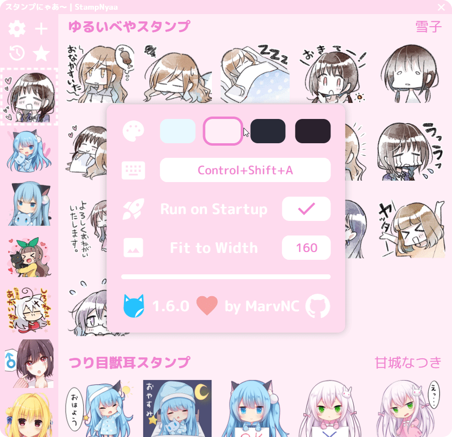

<p align="center">
  
</p>
<h1 align="center">StampNyaa | スタンプにゃあ～</h1>

## 🎉 Download LINE Stickers and Use Them Anywhere

StampNyaa is a simple cross-platform desktop app for downloading and using LINE stickers in Discord, Whatsapp, and anywhere else you can paste images.

## [🚀 Download](https://github.com/MarvNC/StampNyaa/releases/latest)

[Click here to go to the releases page](https://github.com/MarvNC/StampNyaa/releases/latest) and download the appropriate installer for your operating system in "Assets".

## 📚 About

### 🔧 Usage

- **Use the hotkey** `Ctrl+Shift+A` by default to open the app at any time, or click the icon in your system tray.
- **Find your favorite sticker packs** on the [LINE Sticker Shop](https://store.line.me/stickershop/).
- **Download LINE sticker packs** for use with StampNyaa by pressing the + icon in the sidebar and pasting in the sticker pack's URL. Or you can **[add your own stickers](#-add-your-own-stickers)**.
- **Send stickers** by clicking on them in the app, and they will be automatically pasted to the app you're currently using.

Keep in mind that sticker packs from LINE are created by talented artists and are sold for use in the LINE app; this application simply aims to let you to use them in other apps. Make sure to support the creators by purchasing the sticker packs you use!

### 🎞️ Showcase

|            **Send Stickers on Discord**             |       **Download Sticker Packs from LINE**        |
| :-------------------------------------------------: | :-----------------------------------------------: |
|  |  |
|                 **Choose a Theme**                  |         **Manage and Sort Your Stickers**         |
|              |          |

Here are the creators whose stickers are shown in the above images:

- [雪子](https://store.line.me/stickershop/author/1719182/ja) - Futaribeya mangaka
- [甘城なつき](https://store.line.me/stickershop/author/95033/ja) - Nyaa stamps
- [こもわた遙華](https://store.line.me/stickershop/author/674845/ja) - Famous eroge SD artist
- [ななひら](https://store.line.me/stickershop/author/283446/ja) - Nanahira
- [まどそふと](https://store.line.me/stickershop/author/106050/ja) - Madosoft
- [Navel](https://store.line.me/stickershop/author/79657/ja) - Navel, featuring 小倉朝日
- [clear_blue](https://store.line.me/stickershop/author/552857/ja) - Publisher of stickers for Yuzusoft

## 🎨 Add Your Own Stickers

StampNyaa supports adding your own sticker packs to the app.

- Simply add a folder to the `stickers` directory in the app's sticker folder, which is located in your `{user}/Pictures` folder by default.
- The folder name will be used as the sticker pack name by default, and the images inside will be used as the stickers.
- You will also need to add a sticker named `main.png` to be used as the icon representing the sticker pack in the sidebar.
- Note that only `.png` images are currently supported.

## 🤝 Acknowledgements & Contribution

This app would not exist if it were not for jeffshee's **[LINEStickerKeyboard](https://github.com/jeffshee/LINEStickerKeyboard/)** Android app which I use frequently, inspiring me to build StampNyaa for desktop.

Contributions are welcome! If you have any bug reports, feature requests, or questions, please open an issue.

## 🛠️ Development

To run StampNyaa locally, you will need to have [Node.js](https://nodejs.org/en/) installed.

Then clone the repository and install dependencies with npm or yarn:

```bash
git clone https://github.com/MarvNC/StampNyaa.git
cd StampNyaa
npm install
```

To build an installer for your operating system, run:

```bash
npm run build
```

To run:

```bash
npm start
```
